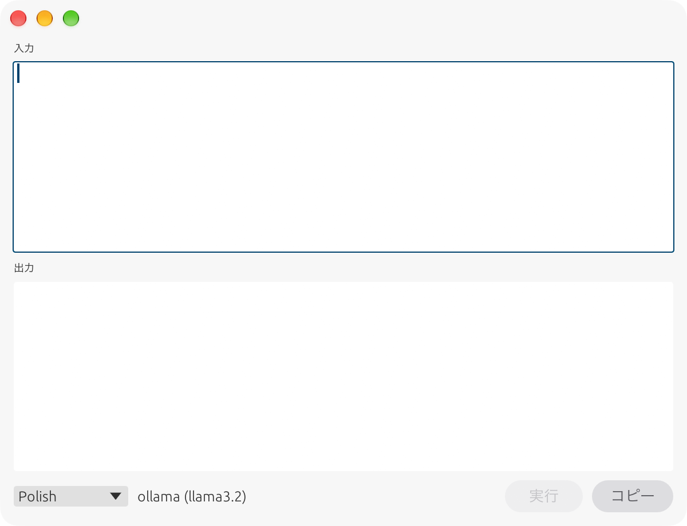
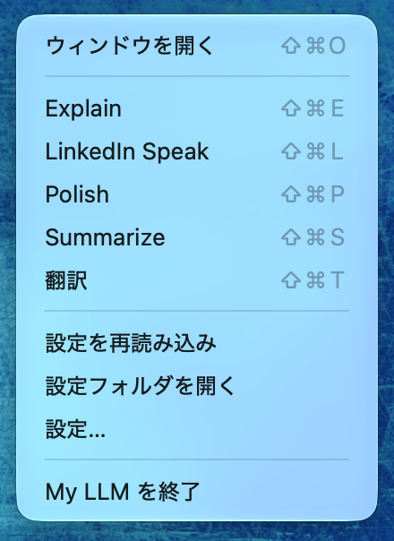
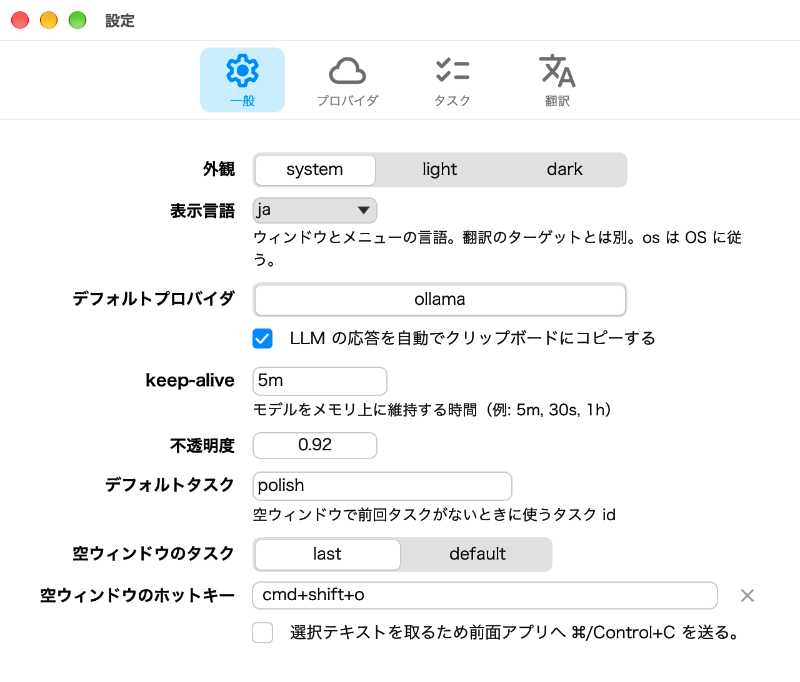
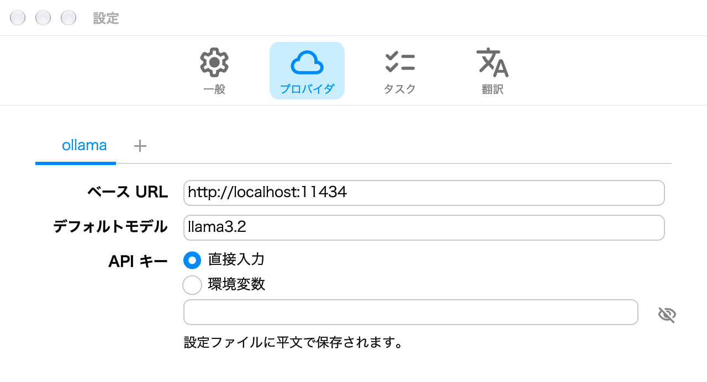
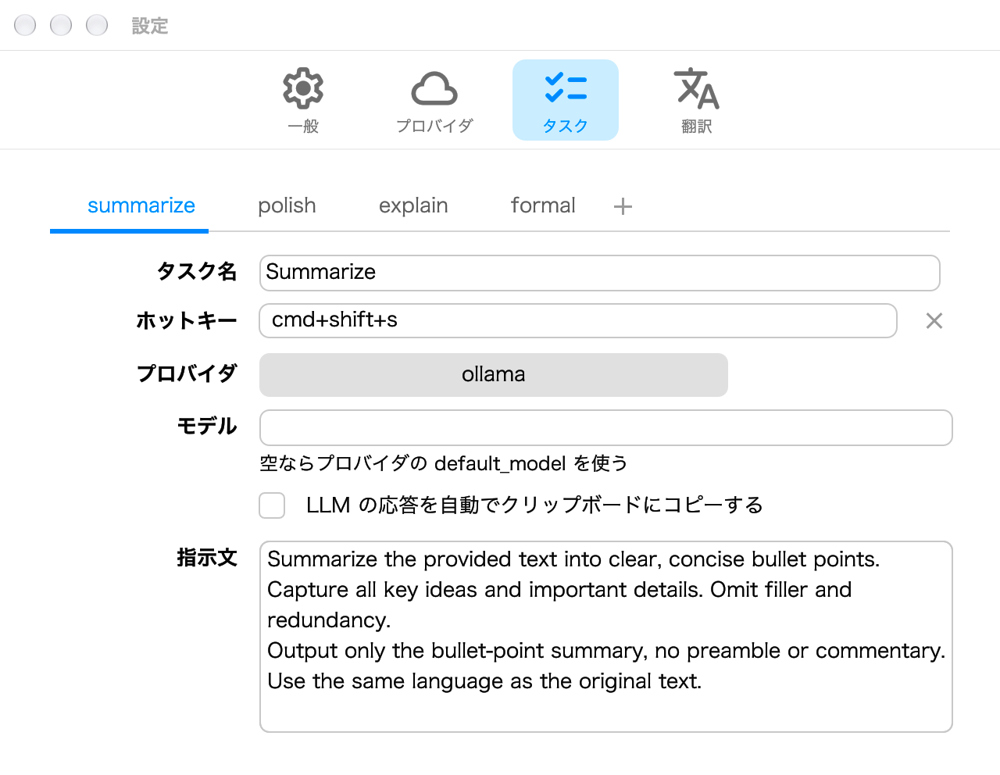
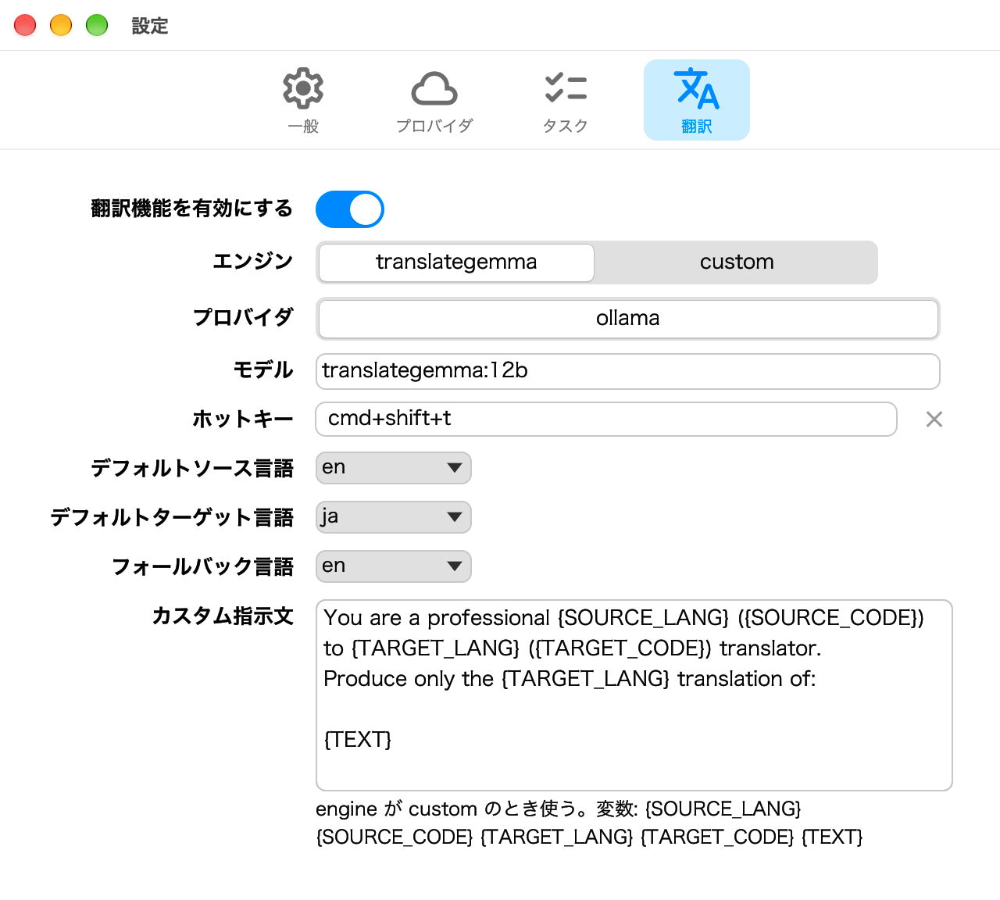

  

  <a href="README.md">English</a> | 日本語

  <strong>テキストを選ぶか入力し，名前付きタスクへ渡してストリーミング結果を得る。</strong> 
  浮動ウィンドウ，トレイ，ホットキーを備えた個人用 LLM ツールキットです。

  

  
  
  
  

---

## できること

- ストリーミング出力とタスク選択のある浮動ウィンドウ
- トレイ / メニューバー（macOS と Windows）と，タスクごとのグローバルホットキー
- ひとつの `config.toml` で名前付きタスクを定義
- ソース言語を自動検出する翻訳（16 言語）
- ローカルの [Ollama](https://ollama.com)，またはクラウドの OpenAI / Anthropic
- 別ウィンドウの設定
- ウィンドウ，トレイ，設定のラベルは OS の言語に従うか，自分で選べる

## 動作環境

| プラットフォーム | 要件 |
| ---------------- | ---- |
| macOS | macOS 13 Ventura 以降（Apple Silicon または Intel） |
| Windows | Windows 11，x86-64 |

あわせて，起動中の [Ollama](https://ollama.com)，または OpenAI / Anthropic の API キーが必要です。

## インストール

### macOS

macOS 版は署名・公証済みです。

1. [Releases](https://github.com/rinodrops/myllm/releases/latest) からお使いの Mac 用 DMG をダウンロードします。
   - **`My-LLM-vX.X.X-darwin-arm64.dmg`** — Apple Silicon
   - **`My-LLM-vX.X.X-darwin-x86_64.dmg`** — Intel
2. DMG を開き，**My LLM.app** をアプリケーションフォルダにドラッグします。
3. 起動するとメニューバーにアイコンが表示されます。

### Windows

Windows 版の zip は未署名です。

1. [Releases](https://github.com/rinodrops/myllm/releases/latest) から **`My-LLM-vX.X.X-windows-x86_64.zip`** をダウンロードします。
2. ZIP を展開します。**`myllm.exe`** と **`settings.exe`** は同じフォルダに置いてください。
3. **`myllm.exe`** を実行します。タスクトレイにアイコンが表示されます。

## 使い方

アプリを起動するとトレイに常駐します。メニューバーから設定済みのタスクを選ぶか，そのホットキーを押すと，ウィンドウが開き，クリップボードの内容が入力に入り，自動で **実行** されます。設定で，前面ウィンドウの選択テキストを入力にすることもできます。**ウィンドウを開く** はテキストを取らず，実行もしません。

### ウィンドウ

  

上が入力，下が出力です。下部バーにタスク選択と **実行** / **コピー** があります。応答は出力へストリーミングされます。**コピー** と任意の自動コピーは結果をクリップボードへ書き込みます。

### メニューバー / タスクトレイ

  

- **ウィンドウを開く** — テキストを取らず，実行もせずにウィンドウを表示
- 設定したタスク。翻訳が有効なら **翻訳** も表示 — ウィンドウを開き，クリップボードを入力にして **実行**
- **設定を再読み込み**，**設定フォルダを開く**，**設定…**，**My LLM を終了**

## 設定

トレイの **設定…** から開きます。初回起動時に `config.toml` の雛形がコピーされます。

- macOS: `~/.config/myllm/config.toml`
- Windows: `%APPDATA%\myllm\config.toml`

**表示言語**（`ui_lang`）はウィンドウとメニューの言語です。翻訳のターゲットとは独立しています。

トレイやホットキーからタスクを実行するとき，既定ではクリップボードが入力になります。**一般** の **選択テキストを取るため前面アプリへ ⌘/Control+C を送る** をオンにすると，前面ウィンドウの選択テキストを入力にします。

<table>
<tr>
<td align="center">
   
  <em>一般</em>
</td>
<td align="center">
   
  <em>プロバイダ</em>
</td>
</tr>
<tr>
<td align="center">
   
  <em>タスク</em>
</td>
<td align="center">
   
  <em>翻訳</em>
</td>
</tr>
</table>

## リリースノート

### 1.0.0

最初の安定版です。

- 浮動結果ウィンドウ，トレイ，ホットキー，ストリーミング出力
- Ollama，OpenAI，Anthropic
- TranslateGemma またはカスタム指示による翻訳
- 同梱の別プロセスとしての設定
- ウィンドウ，トレイ，設定ラベル，通知を 16 言語で表示
- macOS Apple Silicon / Intel の DMG（署名・公証済み）
- Windows `x86_64` zip（未署名）

## ライセンス

MIT License。[LICENSE](LICENSE) を参照してください。

ソースからビルドする場合は [BUILDING.md](BUILDING.md)（英語）を参照してください。
