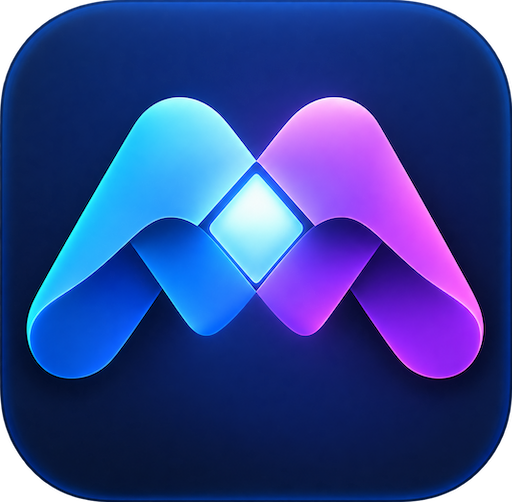
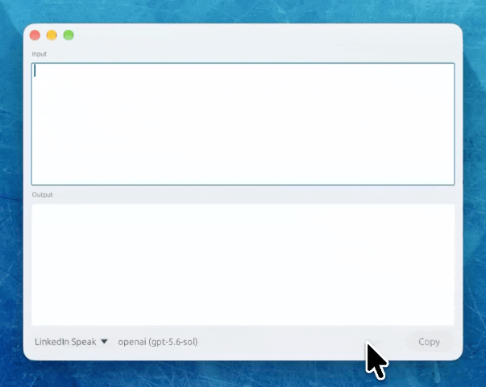
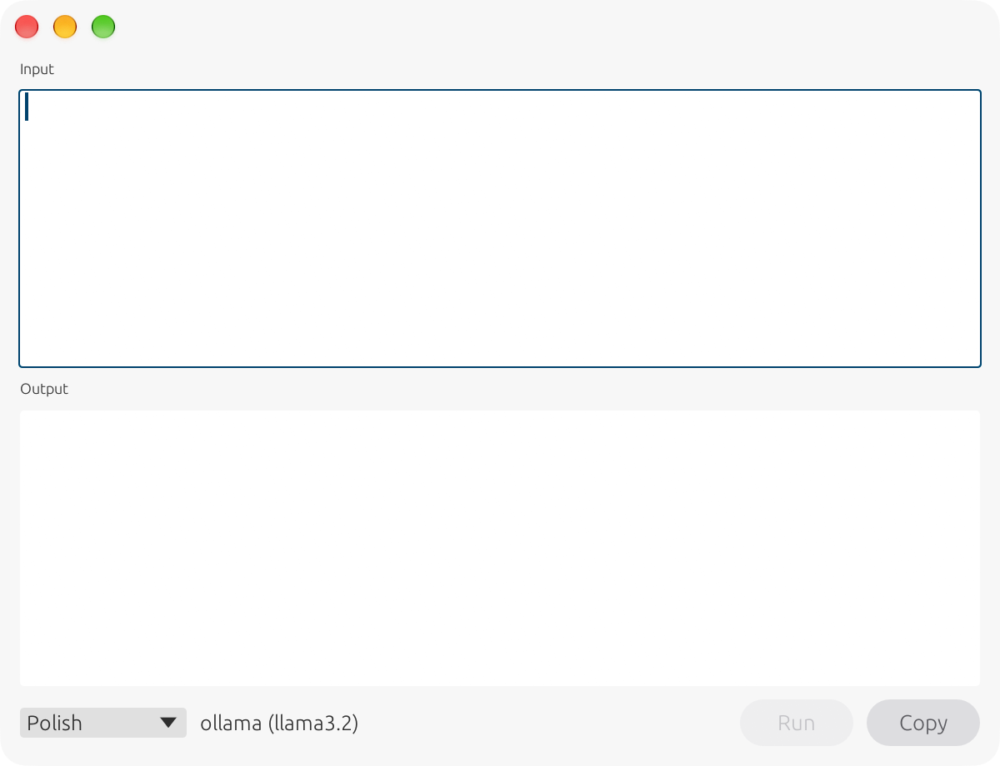
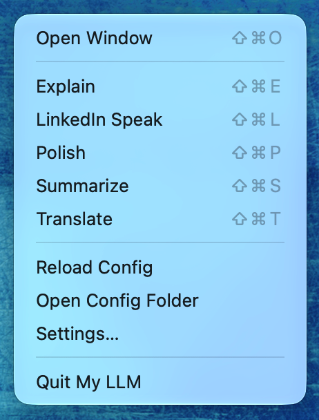
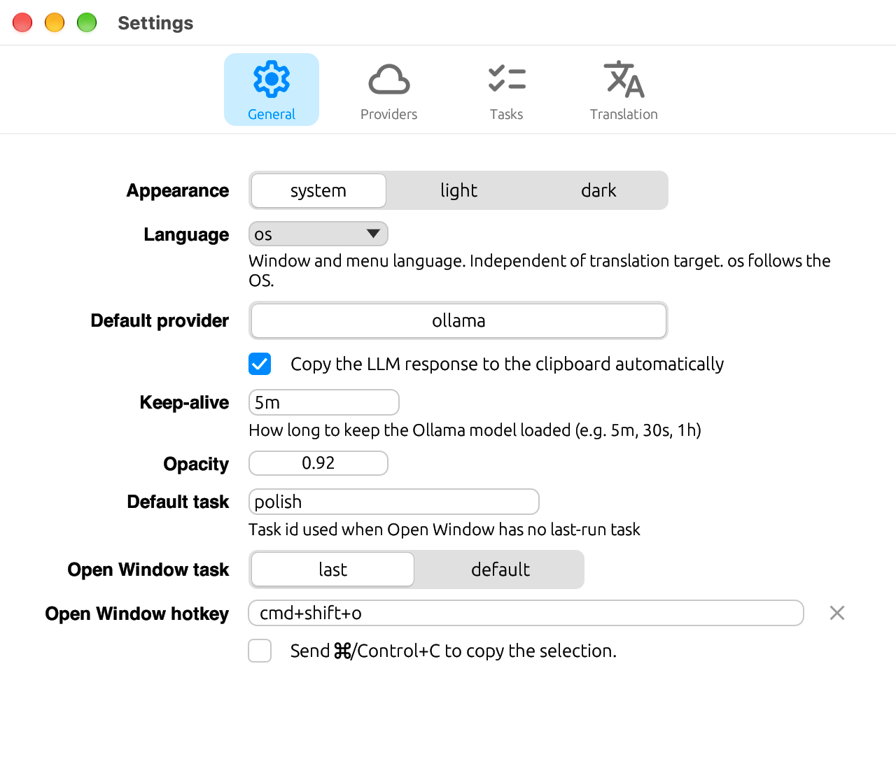
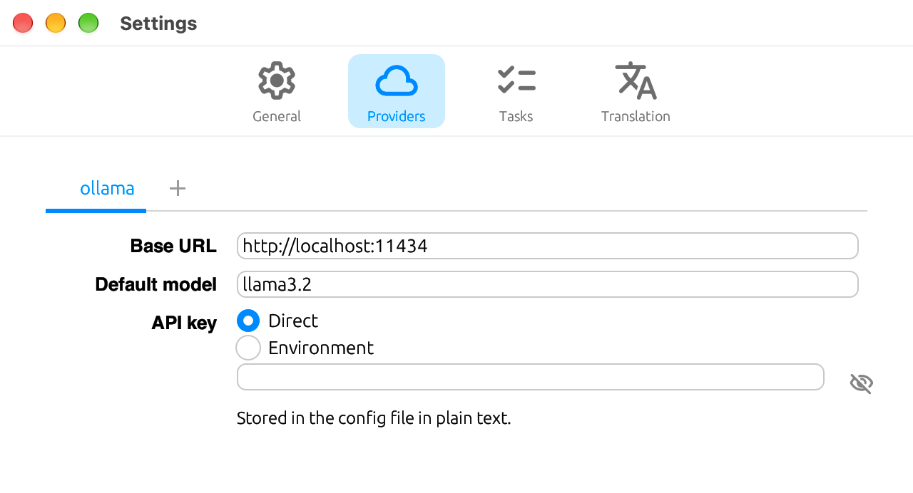
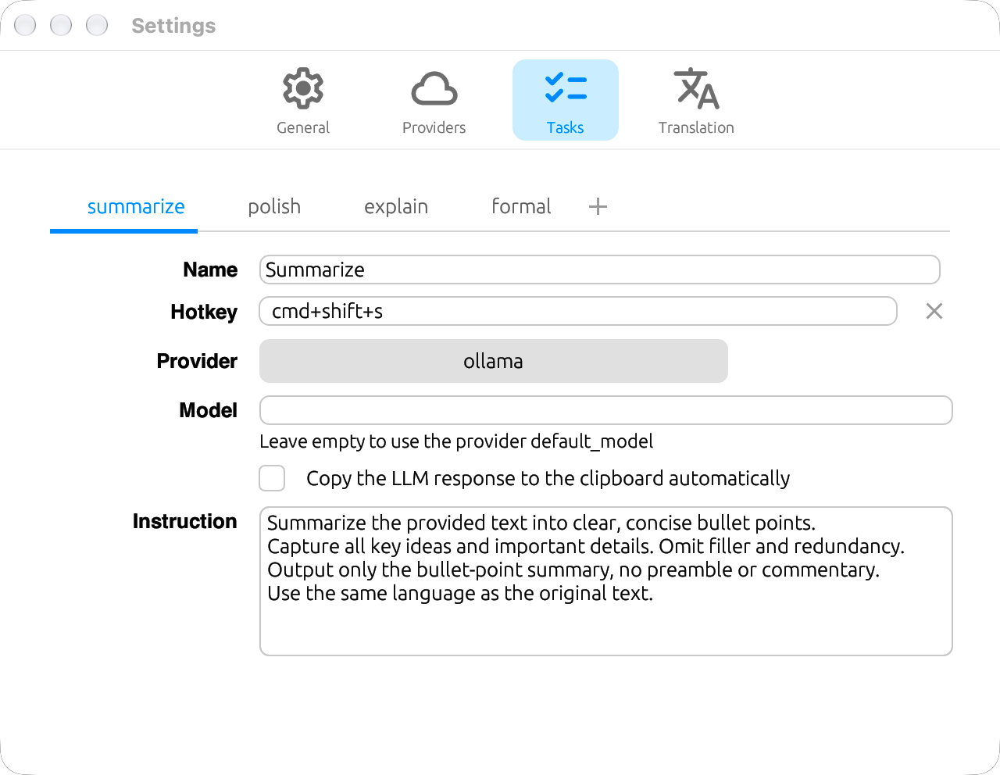
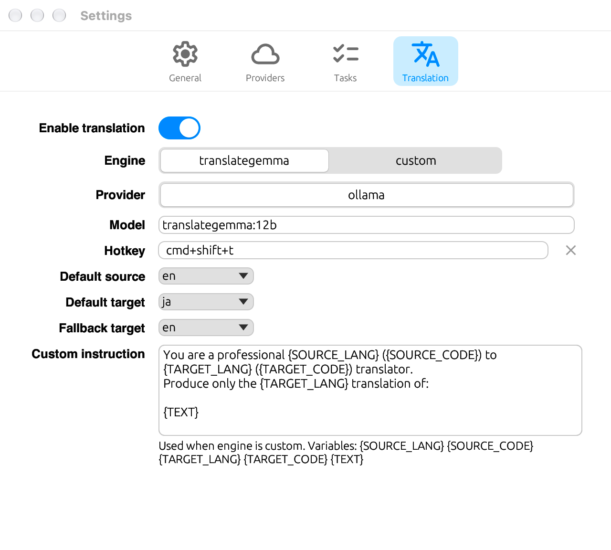

  

  English | <a href="README.ja.md">日本語</a>

  <strong>Select text or type into a named task and get a streamed result.</strong> 
  A personal LLM toolkit with a floating window, tray, and hotkeys.

  

  
  
  
  

---

## Features

- Floating result window with streamed output and a task picker
- Tray / menu bar (macOS and Windows) plus per-task global hotkeys
- Named tasks from a single `config.toml`
- Translation with automatic source detection (16 languages)
- Local [Ollama](https://ollama.com) or cloud OpenAI / Anthropic
- Settings as a separate window
- Window, tray, and Settings labels follow the OS language, or a language you choose

## Requirements

| Platform | Requirement |
| -------- | ----------- |
| macOS | macOS 13 Ventura or later (Apple Silicon or Intel) |
| Windows | Windows 11, x86-64 |

You also need a running [Ollama](https://ollama.com) instance, or an OpenAI / Anthropic API key.

## Installation

### macOS

macOS builds are signed and notarized.

1. Download the DMG for your Mac from [Releases](https://github.com/rinodrops/myllm/releases/latest):
   - **`My-LLM-vX.X.X-darwin-arm64.dmg`** — Apple Silicon
   - **`My-LLM-vX.X.X-darwin-x86_64.dmg`** — Intel
2. Open the DMG and drag **My LLM.app** to your Applications folder.
3. Launch. A menu bar icon appears.

### Windows

The Windows zip is unsigned.

1. Download **`My-LLM-vX.X.X-windows-x86_64.zip`** from [Releases](https://github.com/rinodrops/myllm/releases/latest).
2. Extract the zip. Keep **`myllm.exe`** and **`settings.exe`** in the same folder.
3. Run **`myllm.exe`**. A system tray icon appears.

## Usage

Launch the app to keep the tray resident. Pick a configured task from the menu bar or press its hotkey to open the window, put the clipboard into Input, and **Run** automatically. In Settings you can instead use the selected text in the frontmost window. **Open Window** shows the window without grabbing text or running.

### Window

  

Input is at the top, Output at the bottom. **Run** and **Copy** sit in the bottom bar with the task picker. Responses stream into Output. **Copy** and optional auto-copy write the result to the clipboard.

### Menu bar / system tray

  

- **Open Window** — show the window without grabbing text or running
- Configured tasks, plus **Translate** when translation is enabled — open the window, use the clipboard as Input, and **Run**
- **Reload Config**, **Open Config Folder**, **Settings…**, **Quit My LLM**

## Configuration

Open **Settings…** from the tray. A starter `config.toml` is copied on first launch:

- macOS: `~/.config/myllm/config.toml`
- Windows: `%APPDATA%\myllm\config.toml`

The **Language** setting (`ui_lang`) is the window and menu language. It is independent of the translation target.

By default, a task from the tray or a hotkey uses the clipboard as Input. In **General**, turn on **Send ⌘/Control+C to copy the selection** to use the selected text in the frontmost window instead.

<table>
<tr>
<td align="center">
   
  <em>General</em>
</td>
<td align="center">
   
  <em>Providers</em>
</td>
</tr>
<tr>
<td align="center">
   
  <em>Tasks</em>
</td>
<td align="center">
   
  <em>Translation</em>
</td>
</tr>
</table>

## Release notes

### 1.0.0

First stable release.

- Floating result window, tray, hotkeys, and streamed output
- Ollama, OpenAI, and Anthropic
- Translation with TranslateGemma or a custom instruction
- Settings as a bundled separate process
- Window, tray, Settings labels, and notices in 16 languages
- macOS Apple Silicon and Intel DMGs (signed and notarized)
- Windows `x86_64` zip (unsigned)

## License

MIT License. See [LICENSE](LICENSE).

To build from source, see [BUILDING.md](BUILDING.md).
